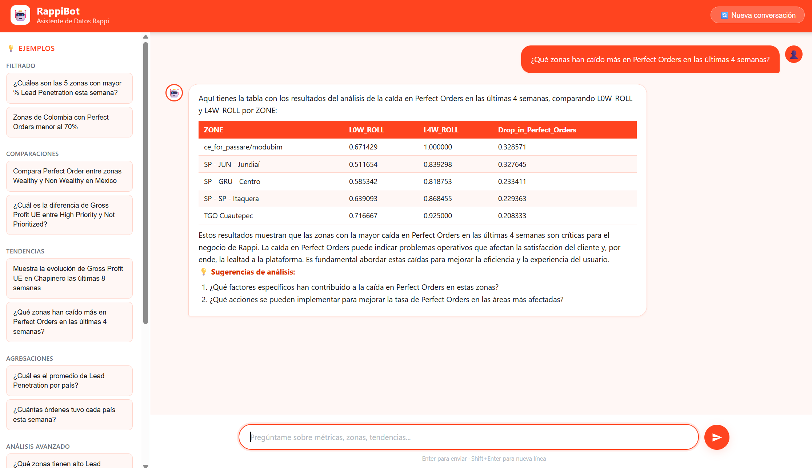

<div align="center">
  
</div>

# 🤖 RappIntelligence

RappIntelligence es un sistema impulsado por IA diseñado para democratizar el acceso a datos. Permite a los equipos consultar métricas operacionales utilizando lenguaje natural a través de un Bot interactivo, además de generar automatizadamente reportes estratégicos ejecutivos semanales mediante su motor de Insights.

## 🚀 Cómo Ejecutar el Proyecto

### 1. Requisitos Previos

1. Asegúrate de tener instalado Python 3.11 y [uv](https://docs.astral.sh/uv/) (el gestor de dependencias utilizado en el proyecto).
2. Clona el repositorio e instala las dependencias:
   ```bash
   uv sync
   ```
3. Crea un archivo `.env` en la raíz del proyecto para alojar tus credenciales. Necesitarás como mínimo:
   ```env
   OPENAI_API_KEY=tu_clave_aqui
   ```
4. Agrega los datos de entrada en la ruta `data/`. Debes tener:
   - `df_metrics.csv`
   - `df_orders.csv`

---

### 2. Ejecutar el Agente Conversacional (Bot)

El bot sirve como una interfaz interactiva donde cualquier usuario puede explorar los datos haciendo preguntas sin necesidad de conocimientos técnicos o SQL.

```bash
uv run python main.py
```
Abre tu navegador web en: **http://localhost:8080** 

- **¿Qué puedes analizar?**
  - **Filtros rápidos:** *¿Cuáles son las 5 zonas con mayor Lead Penetration esta semana?*
  - **Comparativas:** *Compara Perfect Order entre zonas Wealthy y Non Wealthy en México.*
  - **Identificación de tendencias:** *Evolución de Gross Profit UE en Chapinero.*
  - **Explicación de insights:** *¿Qué zonas crecen más en órdenes y qué lo explica?*

---

### 3. Ejecutar el Generador Executivo de Reportes (Insights)

El módulo de Insights utiliza un pipeline avanzado (LangGraph ReAct) para analizar cruces de métricas a nivel país, ciudad y zona, y emitir recomendaciones tácticas fundamentadas.

```bash
uv run python Insights/main.py
```

- **¿Qué genera?**
  - El script evaluará todo el ecosistema y escribirá una pieza de narrativa profesional.
  - Podrás encontrar el resultado en formato `Reporte_Estrategico_Rappi.md` (Markdown) y `Reporte_Estrategico_Rappi.pdf` (PDF) dentro de la carpeta `Insights/`.
  - *Nota: Para la generación y el renderizado correcto del archivo PDF, debes tener `wkhtmltopdf` instalado en tu sistema y referenciado en el proyecto.*

---

- **Bot Principal (`scr/`)**: 
  - **`api.py`**: Servidor FastAPI local.
  - **`agent.py`**: Maneja el flujo interactivo de los usuarios con LangGraph. Utiliza nodos específicos (`router`, `semantic_mapper`, `analyst`, `responder`, y `summarizer`). El núcleo analítico usa `create_pandas_dataframe_agent` interconectado con GPT-4o para interpretar datos. 
  - **Frontend (`static/`)**: Una UI simple en HTML, CSS y JS puro para chat en tiempo real.
- **Insights Pipeline (`Insights/`)**:
  - **`tools_rappi.py`**: Aloja lógicas robustas de análisis con métodos como Momentum, Z-score Benchmarking y Riesgo Multivariable cruzando métricas directamente desde DataFrames.
  - **`main.py`**: Implementa Graph de LangGraph (`generation_node` y `reflection_node`) con Prompting estricto orientado a negocios para forzar al LLM a contar una "historia accionable". Finalmente formatea la salida en Markdown/HTML y PDF mediante bibliotecas estándar.

---

## 🔍 Observabilidad (Langfuse)

El proyecto incluye integración profunda con **Langfuse** para ambas secciones (Bot e Insights) de forma que puedas trazar el consumo de tokens, uso de CPU y lógica de toma de decisión del LLM paso a paso. 

Para habilitarlo, necesitas contar con claves de Langfuse válidas y configurarlas en el `.env`:

```env
# RappIntelligence (Bot)
LANGFUSE_SECRET_KEY="sk-lf-..."
LANGFUSE_PUBLIC_KEY="pk-lf-..."
LANGFUSE_BASE_URL="https://cloud.langfuse.com"

# RappInsights (Insights Pipeline)
LANGFUSE_INSIGHTS_SECRET_KEY="sk-lf-..."
LANGFUSE_INSIGHTS_PUBLIC_KEY="pk-lf-..."
LANGFUSE_INSIGHTS_BASE_URL="https://cloud.langfuse.com"
```

El Bot inyecta su propio `CallbackHandler` de Langfuse por sesión para registrar las consultas en la interfaz (`scr/observability.py`), mientras que el Pipeline de Insights tiene su propio entorno (separado con el prefijo `_INSIGHTS_`) para registrar la generación masiva de análisis e inferencias (`Insights/main.py`).
