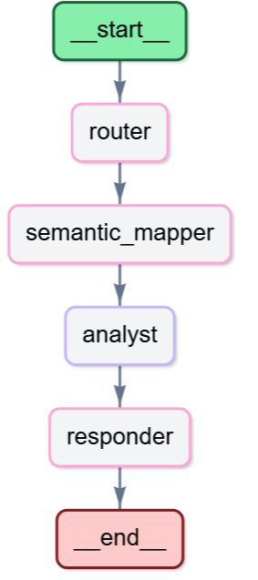
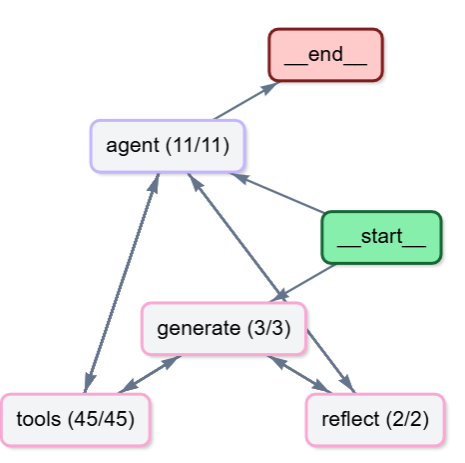

<div align="center">
  
</div>

# 🤖 RappIntelligence

RappIntelligence es un sistema impulsado por IA diseñado para democratizar el acceso a datos. Permite a los equipos consultar métricas operacionales utilizando lenguaje natural a través de un Bot interactivo, además de generar automatizadamente reportes estratégicos ejecutivos semanales mediante su motor de Insights.

## 🚀 Cómo Ejecutar el Proyecto

### 1. Requisitos Previos

1. Asegúrate de tener instalado Python 3.11 y [uv](https://docs.astral.sh/uv/) (el gestor de dependencias utilizado en el proyecto).
2. Clona el repositorio e instala las dependencias:
   ```bash
   uv sync
   ```
3. Crea un archivo `.env` en la raíz del proyecto para alojar tus credenciales. Necesitarás como mínimo:
   ```env
   OPENAI_API_KEY=tu_clave_aqui
   ```
4. Agrega los datos de entrada en la ruta `data/`. Debes tener:
   - `df_metrics.csv`
   - `df_orders.csv`

---

### 2. Ejecutar el Agente Conversacional (Bot)

El bot sirve como una interfaz interactiva donde cualquier usuario puede explorar los datos haciendo preguntas sin necesidad de conocimientos técnicos o SQL.

```bash
uv run python main.py
```
Abre tu navegador web en: **http://localhost:8080** 

- **¿Qué puedes analizar?**
  - **Filtros rápidos:** *¿Cuáles son las 5 zonas con mayor Lead Penetration esta semana?*
  - **Comparativas:** *Compara Perfect Order entre zonas Wealthy y Non Wealthy en México.*
  - **Identificación de tendencias:** *Evolución de Gross Profit UE en Chapinero.*
  - **Explicación de insights:** *¿Qué zonas crecen más en órdenes y qué lo explica?*

---

### 3. Ejecutar el Generador Executivo de Reportes (Insights)

El módulo de Insights utiliza un pipeline avanzado (LangGraph ReAct) para analizar cruces de métricas a nivel país, ciudad y zona, y emitir recomendaciones tácticas fundamentadas.

```bash
uv run python Insights/main.py
```

- **¿Qué genera?**
  - El script evaluará todo el ecosistema y escribirá una pieza de narrativa profesional.
  - Podrás encontrar el resultado en formato `Reporte_Estrategico_Rappi.md` (Markdown) y `Reporte_Estrategico_Rappi.pdf` (PDF) dentro de la carpeta `Insights/`.
  - *Nota: Para la generación y el renderizado correcto del archivo PDF, debes tener `wkhtmltopdf` instalado en tu sistema y referenciado en el proyecto.*

## 🏗️ Arquitectura del Proyecto

El proyecto está dividido en dos grandes módulos, cada uno respaldado por agentes y grafos de tareas con LangGraph:

### 1. Bot Principal (RappIntelligence)

<div align="center">
  
</div>

El flujo de conversación en `scr/agent.py` sigue un diseño guiado por estados (`StateGraph`) estructurado en 5 nodos principales:

1. **`router_node`**: Toma la pregunta del usuario y usa un LLM (gpt-4o-mini) para clasificar si es una consulta de datos (`data`) o una consulta de conocimiento general (`general`).
2. **`semantic_mapper_node`**: Si es de datos, mapea en formato JSON los nombres de columnas, filtros, agrupaciones y métricas que necesita evaluar, basándose en el esquema de los dataframes.
3. **`pandas_analyst_node`**: Ejecuta el grueso del trabajo duro. Aquí un agente ReAct (`create_pandas_dataframe_agent` impulsado por gpt-4o) toma la instrucción enriquecida del mapper, la transforma en sentencias seguras de Python, extrae y agrupa la información de los DFs (`df_metrics.csv` y `df_orders.csv`) y elabora un análisis en base de los resultados.
4. **`responder_node`**: Modela el texto del análisis directo a un tono empresarial ("VP of SP&A") para que la respuesta final al usuario sea comprensible, ejecutiva, y orientada a los negocios.
5. **`summarizer_node`**: Si la conversación supera los 10 turnos, este nodo comprime el historial de mensajes de fondo, manteniéndola rápida y ahorrando consumo de tokens continuos.

---

### 2. Generador Ejecutivo (RappInsights Pipeline)

<div align="center">
  
</div>

Este módulo no espera preguntas, su objetivo es analizar activamente la base de datos de inicio a fin para producir un reporte gerencial. Su ejecución en `Insights/main.py` y `Insights/tools_rappi.py` sigue un diseño ReAct cerrado con auditoría (Reflexión):

1. **Despliegue de Herramientas (15 Tools)**: Se inyectan 15 herramientas de análisis al LLM (`gpt-4o`, 16K tokens). Entre ellas: Riesgo Sistémico (Multivariable), Burn ROI, Cuellos de Botella del Funnel, Anomalías WoW filtradas estadísticamente, y Brechas de Monetización.
2. **`generation_node`**: El "Director de Estrategia" del agente invoca estas herramientas. Revisa toda la data en simultánea y construye una versión en bruto del informe, donde los problemas se agrupan temáticamente (no por país o ciudad), conectando métricas causalmente (e.j "Cae el revenue, el síntoma raíz es CVR Add to Cart").
3. **`reflection_node`**: Cumple la fase de auditoría. Se invoca bajo el rol de un "VP de Estrategia", que califica rigurosamente el informe recién emitido en 7 criterios (como verificar que no haya tablas consecutivas, que los hallazgos buenos y malos estén en el mismo párrafo para mejor contraste, y que haya llamadas a la acción reales). 
4. **Retroalimentación y Salida**: Si el reporte es defectuoso, se manda `reflect` de regreso como crítica al ciclo generador. Lo hace un máximo de 3 veces hasta responder "APROBADO". En ese momento, se convierte primero en formato `Markdown`, luego se parsea con estilos empresariales `CSS` y WKHTMLTOPDF lo exporta en `Reporte_Estrategico_Rappi.pdf`.


## 🔍 Observabilidad (Langfuse)

El proyecto incluye integración profunda con **Langfuse** para ambas secciones (Bot e Insights) de forma que puedas trazar el consumo de tokens, uso de CPU y lógica de toma de decisión del LLM paso a paso. 

Para habilitarlo, necesitas contar con claves de Langfuse válidas y configurarlas en el `.env`:

```env
# RappIntelligence (Bot)
LANGFUSE_SECRET_KEY="sk-lf-..."
LANGFUSE_PUBLIC_KEY="pk-lf-..."
LANGFUSE_BASE_URL="https://cloud.langfuse.com"

# RappInsights (Insights Pipeline)
LANGFUSE_INSIGHTS_SECRET_KEY="sk-lf-..."
LANGFUSE_INSIGHTS_PUBLIC_KEY="pk-lf-..."
LANGFUSE_INSIGHTS_BASE_URL="https://cloud.langfuse.com"
```

El Bot inyecta su propio `CallbackHandler` de Langfuse por sesión para registrar las consultas en la interfaz (`scr/observability.py`), mientras que el Pipeline de Insights tiene su propio entorno (separado con el prefijo `_INSIGHTS_`) para registrar la generación masiva de análisis e inferencias (`Insights/main.py`).
